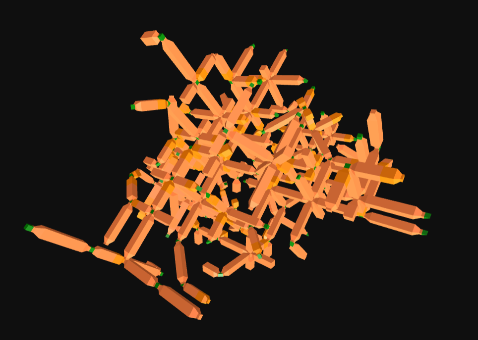

# Reclaimed-Designs-Catalog

Design outputs and assembled proposals generated from the Reclaim Seoul design systems, prepared for browsing and visualization in the Wasp Atlas, and for AR-guided assemblies in HiveLens.

## Available designs

### [bottles-system](https://github.com/ReclaimSeoul/Reclaimed-Design-Systems/tree/main/systems/bottles-system)

|  |  |
|---|---|
| [](designs/test-group/design-01)<br>**[Chair Frame](designs/test-group/design-01)**<br>A chair frame prototype generated from reclaimed plastic bottles using the bottles design system.<br><sub>`test-group_design-01`</sub><br><sub>`furniture` `test` `plastic` `bottles`</sub><br>[design.json](designs/test-group/design-01/design.json) / [meta.json](designs/test-group/design-01/meta.json) |  |

### [plasticbottles](https://github.com/ReclaimSeoul/Reclaimed-Design-Systems/tree/main/systems/plasticbottles)

|  |  |
|---|---|
| [](designs/test-group/design-03)<br>**[Random Test](designs/test-group/design-03)**<br>A random test prototype generated from reclaimed plastic bottles using the plasticbottles design system.<br><sub>`test-group_design-03`</sub><br><sub>`random` `test` `plastic` `bottles`</sub><br>[design.json](designs/test-group/design-03/design.json) / [meta.json](designs/test-group/design-03/meta.json) | [](designs/test-group/design-02)<br>**[Small Pavillion](designs/test-group/design-02)**<br>A small pavillion prototype generated from reclaimed plastic bottles using the plasticbottles design system.<br><sub>`test-group_design-02`</sub><br><sub>`pavillion` `test` `plastic` `bottles`</sub><br>[design.json](designs/test-group/design-02/design.json) / [meta.json](designs/test-group/design-02/meta.json) |

## Repository structure

```text
designs/
  <group-slug>/
    <design-slug>/
      design.json
      meta.json
      00_thumb.png
      README.md

catalog.json
scripts/
  build_catalog.mjs
```

---

This README was generated automatically from `meta.json` by `scripts/build_catalog.mjs`.
