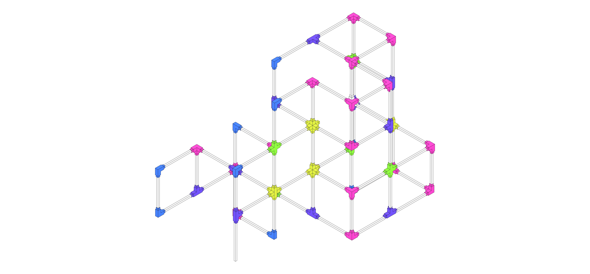

# melted bottles

## Description

A melted plastic joint and wood frame prototype generated from reclaimed plastic bottles.

## Information

| Field | Value |
|---|---|
| ID | `anonymous-coexistence-design01` |
| Group | `anonymous-coexistence` |
| System | [melted-plastic-2](https://github.com/ReclaimSeoul/Reclaimed-Design-Systems/tree/main/systems/melted-plastic-2) |
| Units | `mm` |
| Author | _Unknown author_ |
| Tags | `melted` `plastic` `pavilion` `bottles` |

## Files

- [design.json](design.json)
- [meta.json](meta.json)
- [00_thumb.jpg](00_thumb.jpg)
## Assets

<table>
  <tr>
    <td width="50%" valign="top"></td>
    <td width="50%"></td>
  </tr>
</table>

---

This README was generated automatically from `meta.json` by `scripts/build_catalog.mjs`.
