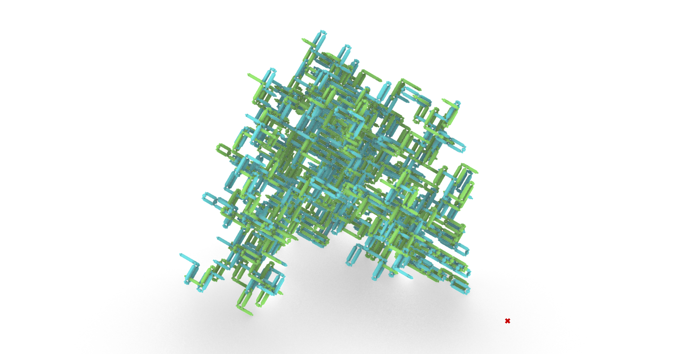

# Plastic Chain Pavillion

## Description

A system frame prototype generated from reclaimed plastic bottles using the bottles chains system.

## Information

| Field | Value |
|---|---|
| ID | `plastic-chains_design-01` |
| Group | `plastic-chains` |
| System | [plasticchain45](https://github.com/ReclaimSeoul/Reclaimed-Design-Systems/tree/main/systems/plasticchains45) |
| Units | `mm` |
| Author | _Unknown author_ |
| Tags | `plastic` `bottles` `Pavillion` |

## Files

- [design.json](design.json)
- [meta.json](meta.json)
- [00_thumb.png](00_thumb.png)

---

This README was generated automatically from `meta.json` by `scripts/build_catalog.mjs`.
